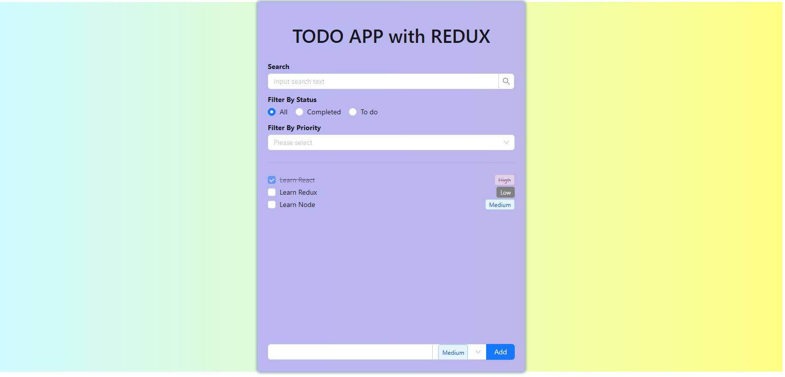

# TodoApp Redux

TodoApp Redux is a simple task management application, built using Redux and React. The application allows users to add, modify and delete tasks in the list. TodoApp Redux is designed to display a list of jobs categorized by status, including "High", "Medium" and "Low" states.

## Installation Instructions

To install TodoApp Redux, you need to do the following steps:

1. Clone this project from GitHub to your machine with the command: `git clone <path to repo>`
2. Open terminal and run command `npm install` to install dependencies.
3. Run the command `npm run dev` to start the application.

## Feature

TodoApp Redux offers the following features:

- Add new job to the list
- Editing job content
- Delete job
- Categorize work by status "Incomplete", "In progress" and "Completed"
- Storing job data using Redux
